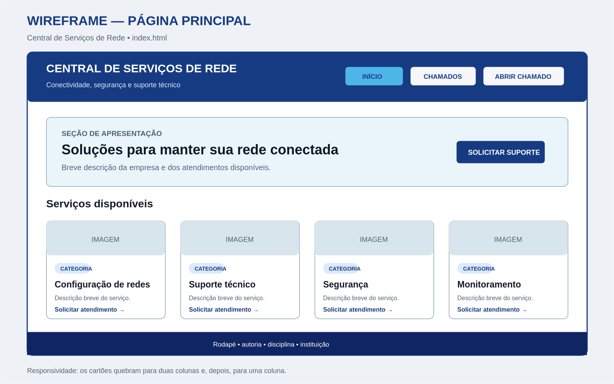
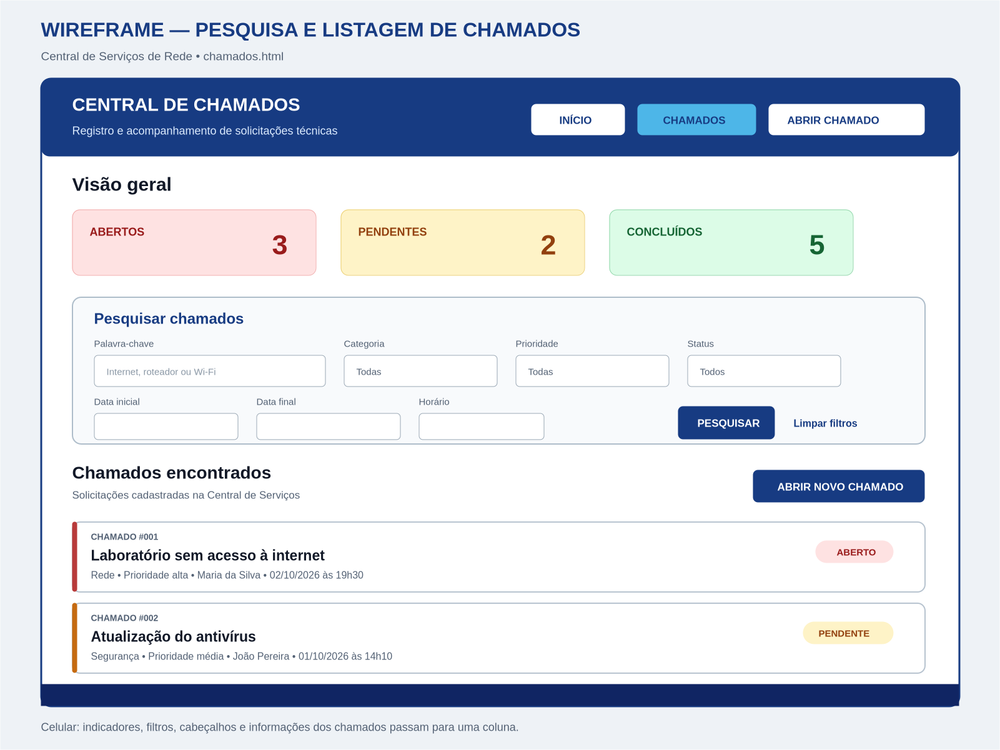
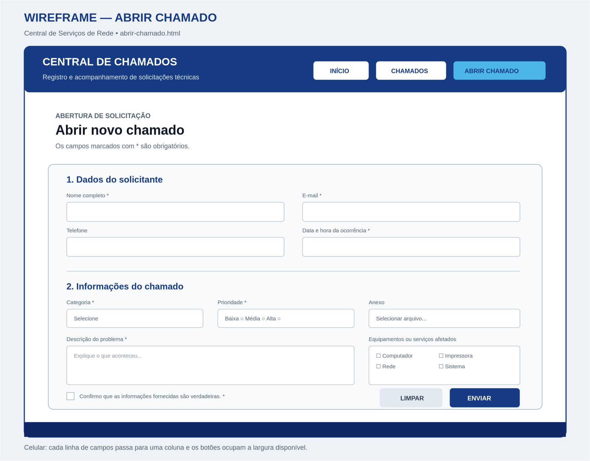

# Avaliação Prática N1 — Central de Serviços de Rede

**Disciplina:** Desenvolvimento Web I  
**Curso:** Tecnologia em Redes de Computadores  
**Data:** 2 de outubro de 2026  
**Modalidade:** Individual  
**Valor:** 10,0 pontos  
**Tempo previsto:** 3h30

## Contexto

Uma empresa precisa disponibilizar uma interface Web para apresentar seus serviços de infraestrutura, consultar solicitações técnicas e permitir a abertura de novos chamados.

Nesta avaliação, você deverá desenvolver uma aplicação chamada **Central de Serviços de Rede**, utilizando os conhecimentos de HTML e CSS estudados durante o primeiro ciclo da disciplina.

A aplicação será composta por três páginas:

1. Página principal;
2. Pesquisa e listagem de chamados;
3. Abertura de chamado.

Não será necessário utilizar JavaScript, banco de dados ou servidor.

Os formulários terão finalidade estrutural e didática. A pesquisa e o envio dos chamados não precisam funcionar de maneira dinâmica.

---

# Objetivos da avaliação

A avaliação busca verificar se o estudante consegue:

- Criar documentos HTML bem estruturados;
- Utilizar elementos semânticos;
- Criar navegação entre diferentes páginas;
- Organizar conteúdos em seções e artigos;
- Construir cartões com Flexbox;
- Criar formulários HTML;
- Associar corretamente `label`, `for`, `id` e `name`;
- Aplicar validações nativas;
- Organizar folhas de estilo por responsabilidade;
- Utilizar classes e seletores CSS;
- Compreender e aplicar o Box Model;
- Construir layouts fluidos;
- Aplicar responsividade com media queries;
- Organizar e versionar um projeto;
- Documentar o projeto com um `README.md`;
- Publicar a aplicação no GitHub Pages;
- Explicar as decisões adotadas no próprio código.

---

# Nome do repositório

Utilize o seguinte nome:

```text
rc-n1-central-servicos-rede
```

Cada estudante deverá criar o repositório em sua própria conta do GitHub.

---

# Estrutura mínima do projeto

Organize o projeto da seguinte maneira:

```text
dwq-n1-central-servicos-rede/
├── index.html
├── chamados.html
├── abrir-chamado.html
├── README.md
└── assets/
    ├── css/
    │   ├── reset.css
    │   ├── global.css
    │   ├── index.css
    │   ├── chamados.css
    │   └── abrir-chamado.css
    └── img/
        └── imagens-utilizadas
```

Você poderá acrescentar outros arquivos e diretórios, desde que mantenha a organização e consiga explicar a finalidade de cada recurso.

---

# Navegação entre as páginas

As três páginas deverão possuir um cabeçalho com:

- Nome da aplicação;
- Pequena descrição;
- Menu de navegação;
- Link para a página inicial;
- Link para a listagem de chamados;
- Link para a abertura de chamado.

---



# 1. Página principal — `index.html`

A página inicial deverá seguir o primeiro wireframe fornecido.

## Cabeçalho

O cabeçalho deverá apresentar:

- Nome da Central de Serviços;
- Slogan ou pequena descrição;
- Menu com as três páginas.

## Seção de apresentação

Crie uma seção contendo:

- Identificação da seção;
- Título principal;
- Texto de apresentação;
- Link ou botão para a página `abrir-chamado.html`.

Exemplo de título:

```text
Soluções para manter sua rede conectada
```

## Serviços disponíveis

Crie uma seção contendo pelo menos quatro cartões.

Sugestões de serviços:

- Configuração de redes;
- Suporte técnico;
- Segurança da informação;
- Monitoramento de serviços;
- Instalação de equipamentos;
- Configuração de Wi-Fi;
- Cabeamento estruturado;
- Manutenção de computadores.

Cada cartão deverá apresentar:

- Imagem;
- Texto alternativo;
- Categoria;
- Nome do serviço;
- Pequena descrição;
- Link para solicitar atendimento.

Os cartões deverão ser organizados utilizando Flexbox.

---



# 2. Pesquisa e listagem — `chamados.html`

A página deverá seguir o segundo wireframe fornecido.

Ela será responsável por apresentar:

1. Resumo dos chamados;
2. Formulário de pesquisa;
3. Listagem das solicitações.

## Resumo dos chamados

Crie três indicadores:

- Chamados abertos;
- Chamados pendentes;
- Chamados concluídos.

Os indicadores deverão ser organizados utilizando Flexbox.

## Formulário de pesquisa

Crie um formulário com os seguintes filtros:

- Palavra-chave;
- Categoria;
- Prioridade;
- Status;
- Data inicial;
- Data final;
- Horário;
- Botão para pesquisar;
- Link ou botão para limpar os filtros.

Tipos de campos esperados:

```text
search
select
date
time
submit
```

Sugestões de categorias:

- Rede;
- Hardware;
- Software;
- Segurança;
- Acesso.

Sugestões de prioridade:

- Baixa;
- Média;
- Alta.

Status disponíveis:

- Aberto;
- Pendente;
- Concluído.

> O formulário não precisa filtrar os resultados de verdade. Nesta avaliação, serão considerados a estrutura, os campos, os rótulos, a organização visual e a responsividade.

## Listagem dos chamados

Apresente pelo menos seis chamados fictícios.

Cada chamado deverá apresentar:

- Número;
- Título;
- Categoria;
- Prioridade;
- Solicitante;
- Data;
- Hora;
- Status;
- Pequena descrição, quando necessário.

Exemplos:

| Número | Título                            | Categoria | Prioridade | Status    |
| ------ | --------------------------------- | --------- | ---------- | --------- |
| #001   | Laboratório sem acesso à internet | Rede      | Alta       | Aberto    |
| #002   | Atualização do antivírus          | Segurança | Média      | Pendente  |
| #003   | Instalação de impressora          | Hardware  | Baixa      | Concluído |
| #004   | Senha do sistema bloqueada        | Acesso    | Alta       | Aberto    |
| #005   | Computador reiniciando sozinho    | Hardware  | Média      | Pendente  |
| #006   | Configuração do Wi-Fi concluída   | Rede      | Baixa      | Concluído |

## Status dos chamados

Cada status deverá possuir uma classe específica:

```html
<span class="status status-aberto">Aberto</span>

<span class="status status-pendente">Pendente</span>

<span class="status status-concluido">Concluído</span>
```

As cores deverão ser acompanhadas pelo texto do status.
Não utilize apenas a cor para comunicar a situação do chamado.

---



# 3. Abertura de chamado — `abrir-chamado.html`

A página deverá seguir o terceiro wireframe fornecido.

Ela deverá possuir um formulário dividido em grupos.

## Dados do solicitante

Solicite:

- Nome completo;
- E-mail;
- Telefone;
- Data da ocorrência;
- Hora da ocorrência.

## Informações do chamado

Solicite:

- Categoria;
- Prioridade;
- Descrição do problema;
- Equipamentos ou serviços afetados;
- Arquivo complementar;
- Confirmação das informações.

## Categoria

Utilize um `<select>` contendo opções como:

- Rede;
- Hardware;
- Software;
- Segurança;
- Acesso.

## Prioridade

Utilize `radio` para permitir somente uma escolha:

## Equipamentos ou serviços afetados

Utilize `checkbox`, pois mais de uma opção poderá ser selecionada:

- Computador;
- Impressora;
- Rede;
- Sistema;
- Wi-Fi;
- Outro.

## Descrição

Utilize `<textarea>`:

## Arquivo complementar

Utilize `<input:file>`:

````

Caso o formulário utilize envio de arquivos, configure:

```html
<form
  action="#"
  method="post"
  enctype="multipart/form-data"
>
````

## Confirmação

Inclua um checkbox obrigatório:

## Botões

1. Submit
2. Reset

---

# Requisitos dos formulários

Todos os campos deverão possuir:

- Rótulo visível;
- `id`;
- `name`;
- Tipo adequado;
- Associação entre `for` e `id`;
- Validação quando necessária.

Utilize, quando adequado:

- `required`;
- `minlength`;
- `maxlength`;
- `min`;
- `max`;
- `accept`;
- `placeholder`;
- `autocomplete`.

O `placeholder` não substitui o `<label>`.

---

# HTML semântico

Utilize corretamente os elementos estudados:

- `<header>`;
- `<nav>`;
- `<main>`;
- `<section>`;
- `<article>`;
- `<figure>`;
- `<figcaption>`;
- `<form>`;
- `<fieldset>`;
- `<legend>`;
- `<time>`;
- `<footer>`.

Utilize `<div>` quando o agrupamento não possuir um elemento semântico mais adequado.

A escolha dos elementos será considerada na avaliação.

---

# Organização do CSS

Utilize:

## `reset.css`

Responsável por normalizar os estilos padrões do navegador.

## `global.css`

Deverá conter estilos compartilhados, como:

- `body`;
- Tipografia;
- Cores;
- Contêiner;
- Cabeçalho;
- Navegação;
- Links;
- Botões;
- Rodapé.

## `index.css`

Deverá conter:

- Seção de apresentação;
- Cartões de serviços;
- Imagens;
- Categorias.

## `chamados.css`

Deverá conter:

- Indicadores;
- Formulário de pesquisa;
- Listagem;
- Cartões de chamados;
- Badges de status.

## `abrir-chamado.css`

Deverá conter:

- Formulário de abertura;
- Grupos de campos;
- Labels;
- Inputs;
- Select;
- Textarea;
- Fieldsets;
- Checkboxes;
- Radios;
- Botões.

Carregue os arquivos na ordem correta:

```html
<link
  rel="stylesheet"
  href="./assets/css/reset.css"
/>

<link
  rel="stylesheet"
  href="./assets/css/global.css"
/>

<link
  rel="stylesheet"
  href="./assets/css/index.css"
/>
```

---

# Flexbox

Utilize Flexbox em diferentes partes do projeto:

- Menu de navegação;
- Cartões de serviços;
- Indicadores;
- Campos do formulário de pesquisa;
- Informações dos chamados;
- Campos da abertura de chamado;
- Área de botões.

O Flexbox deverá possuir uma finalidade clara.

---

# Layout fluido e responsividade

As três páginas deverão funcionar em telas amplas e estreitas.

Utilize:

- Viewport configurada;
- Medidas relativas;
- Contêiner fluido;
- `max-width`;
- `margin: 0 auto`;
- Flexbox;
- `flex-wrap`;
- `gap`;
- Imagens adaptáveis;
- Pelo menos uma media query;
- `box-sizing: border-box`.

Configuração esperada:

```html
<meta
  name="viewport"
  content="width=device-width, initial-scale=1.0"
/>
```

Exemplo de media query:

```css
@media (max-width: 48rem) {
  nav ul,
  .linha-formulario,
  .cabecalho-chamado {
    flex-direction: column;
  }
}
```

Em telas menores:

- O menu deverá se adaptar;
- Os cartões deverão mudar de linha;
- Os indicadores deverão mudar de linha;
- Os filtros deverão ser organizados em uma coluna;
- Os campos da abertura de chamado deverão ficar em uma coluna;
- Os botões deverão permanecer acessíveis;
- A página não deverá apresentar rolagem horizontal.

---

# Acessibilidade e usabilidade

Observe os seguintes requisitos:

- `lang="pt-br"`;
- Hierarquia adequada de títulos;
- Textos alternativos nas imagens;
- Rótulos visíveis;
- Associação entre `label` e campo;
- Contraste entre texto e fundo;
- Estado de foco visível;
- Links com textos compreensíveis;
- Indicação textual dos status;
- Campos obrigatórios identificados;
- Navegação possível pela tecla `Tab`.

Não remova o `outline` sem criar outra indicação visual de foco.

---

# README

Crie um `README.md` contendo:

- Nome do projeto;
- Nome do estudante;
- Curso e disciplina;
- Objetivo;
- Tecnologias utilizadas;
- Descrição das três páginas;
- Estrutura dos diretórios;
- Recursos implementados;
- Instruções para executar;
- Link do repositório;
- Link do GitHub Pages;
- Dificuldades encontradas;
- Possíveis melhorias.

---

# Git e GitHub

O projeto deverá ser enviado para um repositório público.

Realize commits que representem etapas do desenvolvimento.

Exemplos:

```text
Cria estrutura inicial do projeto
Adiciona página principal e serviços
Implementa pesquisa e listagem de chamados
Cria formulário de abertura de chamado
Adiciona estilos responsivos
Finaliza documentação e publicação
```

Depois do `push`, publique o projeto utilizando o GitHub Pages.

Teste a URL pública antes de realizar a entrega.

---

# Critérios de avaliação

| Critério                                       | Pontuação |
| ---------------------------------------------- | --------: |
| Estrutura, semântica e organização do HTML     |      1,00 |
| Página principal e cartões de serviços         |      1,00 |
| Indicadores, pesquisa e listagem de chamados   |      1,50 |
| Formulário de abertura de chamado              |      1,50 |
| Organização e qualidade do CSS                 |      1,00 |
| Aplicação de Flexbox                           |      1,00 |
| Responsividade e medidas relativas             |      1,25 |
| Navegação, caminhos e acessibilidade           |      0,75 |
| README, Git e GitHub Pages                     |      0,75 |
| Organização, acabamento e explicação do código |      0,25 |
| **Total**                                      | **10,00** |

---

# Regras da avaliação

- A avaliação é individual;
- O estudante deverá compreender o código entregue;
- Não será permitido copiar código de colegas;
- Os materiais da disciplina poderão ser consultados;
- A documentação técnica poderá ser consultada;
- Não é necessário utilizar JavaScript;
- Não é necessário utilizar banco de dados;
- Não é necessário implementar um servidor;
- Os filtros não precisam modificar a listagem;
- O envio do chamado não precisa armazenar os dados;
- O professor poderá solicitar a explicação de qualquer trecho;
- Código que o estudante não conseguir explicar poderá não ser considerado;
- Caso utilize uma ferramenta de Inteligência Artificial, o estudante deverá revisar, testar, adaptar e conseguir explicar integralmente o código produzido;
- A entrega incompleta deverá conter tudo o que foi possível desenvolver;
- Não apague códigos com erro: eles poderão ajudar na análise do processo.

---

# Checklist antes da entrega

## Estrutura geral

- [ ] `index.html` criado;
- [ ] `chamados.html` criado;
- [ ] `abrir-chamado.html` criado;
- [ ] Navegação funcionando;
- [ ] Página atual destacada no menu;
- [ ] Arquivos CSS organizados;
- [ ] Imagens armazenadas em `assets/img`.

## Página principal

- [ ] Seção de apresentação;
- [ ] Botão para solicitar suporte;
- [ ] Pelo menos quatro serviços;
- [ ] Cartões com imagem;
- [ ] Categoria;
- [ ] Descrição;
- [ ] Link para abrir chamado;
- [ ] Organização com Flexbox.

## Página de chamados

- [ ] Indicador de chamados abertos;
- [ ] Indicador de chamados pendentes;
- [ ] Indicador de chamados concluídos;
- [ ] Busca por palavra-chave;
- [ ] Filtro por categoria;
- [ ] Filtro por prioridade;
- [ ] Filtro por status;
- [ ] Data inicial;
- [ ] Data final;
- [ ] Horário;
- [ ] Pelo menos seis chamados;
- [ ] Badges de status;
- [ ] Datas utilizando `<time>`.

## Abertura de chamado

- [ ] Nome completo;
- [ ] E-mail;
- [ ] Telefone;
- [ ] Data;
- [ ] Hora;
- [ ] Categoria;
- [ ] Prioridade;
- [ ] Descrição;
- [ ] Equipamentos afetados;
- [ ] Seleção de arquivo;
- [ ] Confirmação;
- [ ] Botão para limpar;
- [ ] Botão para enviar;
- [ ] Labels associados aos campos;
- [ ] Validações nativas.

## Responsividade

- [ ] Viewport configurada;
- [ ] `box-sizing` aplicado;
- [ ] Contêiner fluido;
- [ ] Flexbox com quebra de linha;
- [ ] Imagens adaptáveis;
- [ ] Media query;
- [ ] Menu adaptável;
- [ ] Campos em uma coluna no celular;
- [ ] Ausência de rolagem horizontal.

## Entrega

- [ ] Nome do estudante no README;
- [ ] Commits realizados;
- [ ] Código enviado ao GitHub;
- [ ] Repositório público;
- [ ] GitHub Pages configurado;
- [ ] Link público testado.

---

# Forma de entrega

Envie na atividade do Classroom:

1. Link do repositório público no GitHub;
2. Link do projeto publicado no GitHub Pages;
3. Breve comentário sobre as dificuldades encontradas;
4. Indicação das partes não concluídas, caso existam.

Exemplo:

```text
Repositório:
https://github.com/seu-usuario/dw1-n1-central-servicos-rede

GitHub Pages:
https://seu-usuario.github.io/dw1-n1-central-servicos-rede/

Dificuldades:
Tive dificuldade para adaptar o formulário em telas pequenas, mas consegui
organizar os campos utilizando Flexbox e uma media query.
```
